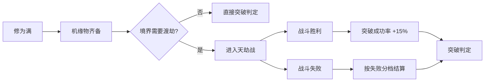

# 07 · 敌人与战斗设计

> 本文档定义《末法仙途》的**敌人体系与战斗内容层**：敌人分级、属性基线、词缀、Boss 多阶段设计、心魔战、天劫、AI 行为表、遇敌与逃跑、掉落规则。
> 敌人 ID、字段结构以 [11-数据表规范](11-数据表规范.md) §5.2 为唯一真源；伤害公式以 [02-核心玩法系统](02-核心玩法系统.md) §3.4 为准；每个区域该出什么敌人以 [10-地图与区域规划](10-地图与区域规划.md) §1 为准。
> 本文档**不发明新术语、不发明新 ID 前缀、不发明新 `kind` / `ai` / `effects` 枚举**。
>
> 相关文档：[01-世界观与设定](01-世界观与设定.md) · [02-核心玩法系统](02-核心玩法系统.md) · [08-物品丹药与法宝](08-物品丹药与法宝.md) · [09-功法与技能体系](09-功法与技能体系.md) · [10-地图与区域规划](10-地图与区域规划.md) · [11-数据表规范](11-数据表规范.md) · [13-技术架构与工程约定](13-技术架构与工程约定.md)

---

## 一、敌人分级

### 1.1 五个分级

分级字段写在 `enemies.json` 的 `level` 中（复用 [11-数据表规范](11-数据表规范.md) §3.1 的稀有度枚举），但**分级决定的不只是稀有度，还决定属性倍率、掉落档位与是否禁逃**。

| 分级 | `level` 值 | 出现方式 | 属性基线倍率 | 掉落档位 | 遇敌禁逃 | 图鉴分类 |
|---|---|---|---|---|---|---|
| **野怪** | `common` / `fine` | `encounter` 层按遭遇表随机，野外随时间/天气刷新 | `×1.00`（`fine` 型 `×1.15`） | 档位 A：`item-mat-*` 为主，0~1 件成品 | 可逃 | `codex.yaoguai` 普通条目 |
| **精英** | `rare` | 每个 `encounter` 区域有 12% 概率替换为精英；秘境保底 1 个精英房 | `×1.55`（`rare`+词缀后约 `×1.8`） | 档位 B：材料 + 1 件丹药/符箓，12% 出 `rare` 法宝碎片 | 可逃（第 3 回合起禁逃） | `codex.yaoguai` 精英条目 |
| **首领** | `epic` | 固定点位或事件触发，不参与随机遇敌 | `×2.30`（多阶段另计） | 档位 C：固定表必掉 1 件 `epic` 级 + 1~3 件材料 | **禁逃** | `codex.boss` 首领条目 |
| **心魔** | `legend` | 突破 / 心境 `< 10` 心魔夜 / 幻境试炼触发 | 镜像玩家：`×1.00` 复制 + 阶段二 `×1.15` | 无常规掉落，给**修为 + 心境** | **禁逃** | 不占 `yaoguai` 条目，计入 `codex.mind` |
| **天劫** | `myth` | 突破事件强制触发（`mq-*` 劫难事件） | `×2.60`，且**无视 30% 防御** | 渡劫成功给境界突破奖励，无物品掉落 | **禁逃** | `codex.tribulation` |

**设计意图**：

1. 野怪是"资源与修为的主要来源"，精英是"地形压力点"，首领是"章节里程碑"，心魔是"自我检定"，天劫是"境界门槛"。
2. 倍率全部作用于 **§1.3 的敌人基线表**，不作用于玩家属性；不同地图之间的难度差异只靠"境界行"切换实现。
3. `level` 与 `kind` 正交：`zombie` 也可以是 `epic`（如 `enemy-zombie-jiang`），`spirit` 也可以是 `common`。

### 1.2 倍率叠加规则

最终属性按**乘法链**结算，顺序固定，便于复现与调试：

```
最终属性 = 境界基线 × 分级倍率 × 词缀倍率 × 周目倍率 × 月相/天气倍率
```

| 因子 | 取值范围 | 来源 |
|---|---|---|
| 境界基线 | §1.3 表 | 地图解锁章节对应的境界行 |
| 分级倍率 | `1.00 / 1.15 / 1.55 / 2.30 / 2.60` | 本节 1.1 |
| 词缀倍率 | `0.85 ~ 1.60` | §3 词缀系统，最多 2 个词缀，倍率相乘 |
| 周目倍率 | 一周目 `1.00`，二周目 `1.35`，三周目 `1.80` | [01-世界观与设定](01-世界观与设定.md) §5.1 多周目 |
| 月圆之夜 | 妖鬼系（`zombie` / `ghost` / `yao`）全属性 `×1.20` | [02-核心玩法系统](02-核心玩法系统.md) §10 |
| 血月事件 | 妖鬼系全属性 `×1.50`（覆盖月圆，不叠乘） | [10-地图与区域规划](10-地图与区域规划.md) §4.2 |
| 夜间 | 僵尸系 `×1.15`，白昼 `×0.85` | [10-地图与区域规划](10-地图与区域规划.md) §4.1 |

> **上限保护**：任何敌人最终属性不得超过同境界玩家基线的 `×3.2`（首领 `×3.6`），超过则钳制并向 `logger.warn` 输出钳制记录。这条规则防止词缀 + 周目 + 血月叠乘出无法通关的怪物。

### 1.3 数值与节奏的归属（本节不定义绝对值）

本节**不定义任何绝对值**。战斗的数值与节奏由 [16-数值设计](16-数值设计.md) 唯一持有，避免双真源：

| 内容 | 唯一定义处 |
|---|---|
| 玩家基础属性（HP / 灵力 / 攻击 / 防御 / 速度 / 神识，按境界与小阶） | [16-数值设计](16-数值设计.md) §4.2 |
| 敌人属性推导公式（玩家同境界属性 × 类型系数 × 地图难度系数） | [16-数值设计](16-数值设计.md) §7.1 |
| 敌人类型系数（杂兵 / 精锐 / 精英 / Boss 各阶段 / 心魔 / 同伴） | [16-数值设计](16-数值设计.md) §7.2 |
| 各境界敌人属性**绝对值区间** | [16-数值设计](16-数值设计.md) §7.3 |
| 战斗回合数目标与校验（普通战 3~5 回合、Boss 8~15 回合） | [16-数值设计](16-数值设计.md) §7.4 |
| 伤害 / 减伤 / 暴击 / 命中 / 保底公式 | [16-数值设计](16-数值设计.md) §6 |

**本节的职责**是给出"敌人该有多强"的**规则**（§1.1 分级语义、§1.2 倍率链、§1.4 遭遇表的境界选择），"具体是多少"一律由 16 给出。数值自洽校验（含伤害公式代入算例）同样在 [16-数值设计](16-数值设计.md) §6 / §7.4。

> **校验约定**：任何新敌人必须在 `enemies.json` 中标注 `baselineRow`（如 `"qi-late"`），校验脚本据此比对 [16 §7.3](16-数值设计.md) 的绝对值区间，防止手填数值漂移。`baselineRow` 为扩展字段，登记在 [11-数据表规范](11-数据表规范.md) §5.2。

### 1.4 遭遇表的境界选择规则

`map-*.json` 的 `encounter` 层引用遭遇表（扩展字段 `encounterTable`）。遭遇表按玩家境界**动态选行**，避免后期地图变"经验田"：

| 玩家境界 vs 地图基准境界 | 选用的敌人境界行 | 修为奖励修正 |
|---|---|---|
| 低于基准 2 阶以上 | 不使用该遭遇表，提示"此地凶险，你尚无立足之力" | — |
| 低于基准 1 阶 | 基准行（敌人按基准出） | `×1.00` |
| 等于基准 | 基准行 | `×1.00` |
| 高于基准 1 阶 | 基准行，敌人词缀数 +1 | `×0.55` |
| 高于基准 2 阶 | 基准行，敌人词缀数 +1、分级 +1 档（野怪→精英） | `×0.25` |
| 高于基准 3 阶及以上 | 只出精英与首领，野怪不再刷新 | `×0.10` |

> 设计意图：**境界压制后刷怪收益迅速衰减**，让玩家自然向新地图流动，而不是在青云镇刷到金丹。

---

## 二、敌人条目（40 条）

### 2.1 字段说明

| 列 | 对应 `enemies.json` 字段 | 取值来源 |
|---|---|---|
| ID | `id` | `enemy-` / `boss-` 前缀，见 [11-数据表规范](11-数据表规范.md) §2 |
| 名称 | `name` | 中文，≤8 字 |
| 种类 | `kind` | 仅 `zombie`/`ghost`/`yao`/`beast`/`human`/`spirit`/`boss` |
| 分级 | `level` | 仅 `common`/`fine`/`rare`/`epic`/`legend`/`myth` |
| 境界行 | `baselineRow` | §1.3 表行键 |
| 出现地图 | `maps` | 对应 [10-地图与区域规划](10-地图与区域规划.md) §1 的遇敌列 |
| 弱点 | `weakness` | 五行（`metal`/`wood`/`water`/`fire`/`earth`）+ 派生（`thunder`/`ice`/`yang`/`slash`） |
| 抗性 | `resist` | 同上 |
| AI | `ai` | 仅 `attacker`/`defender`/`support`/`random`/`boss`/`inner-demon` |
| 掉落要点 | `drops` | 档位 + 代表物品，完整规则见 §9 |

### 2.2 全表

| ID | 名称 | kind | 分级 | 境界行 | 出现地图 | 弱点 | 抗性 | AI | 掉落要点 |
|---|---|---|---|---|---|---|---|---|---|
| `enemy-zombie` | 夜行僵尸 | `zombie` | `common` | 炼气初期 | `map-qingyun`（剧情）、`map-luanzang` | `fire`、`wood` | `water` | `attacker` | 档位 A：`item-mat-shixiong` 40%（1~2） |
| `enemy-zombie-blood` | 僵尸·嗜血 | `zombie` | `fine` | 炼气初期 | `map-qingyun` 郊外 | `fire` | `water`、`earth` | `attacker` | 档位 A + 词缀加成：`item-mat-xuejing` 25% |
| `enemy-zombie-iron` | 僵尸·铁甲 | `zombie` | `fine` | 炼气初期 | `map-qingyun` 郊外 | `thunder`、`fire` | `slash`、`earth` | `defender` | 档位 A：`item-mat-tiejia-pian` 30% |
| `enemy-langyao` | 荒狼 | `beast` | `common` | 炼气初期 | `map-houshan` | `fire` | `wood` | `attacker` | 档位 A：`item-mat-langpi` 45% |
| `enemy-shanxiao` | 山魈 | `yao` | `fine` | 炼气初期 | `map-houshan` | `metal` | `wood`、`earth` | `random` | 档位 A：`item-mat-yaogu` 20%，`item-dan-huiqi` 15% |
| `enemy-dufeng` | 毒蜂群 | `beast` | `common` | 炼气初期 | `map-houshan` | `fire`、`wind` | — | `random` | 档位 A：`item-mat-fengdu-zhen` 50%（2~3） |
| `enemy-houshan-ling` | 药圃山灵 | `spirit` | `rare` | 炼气初期 | `map-houshan`（山神庙） | `earth` | `water`、`wood` | `support` | 档位 B：`item-mat-lingcao-*` 必掉 1、`item-dan-huiqi` 1 |
| `enemy-youhun` | 游魂 | `ghost` | `common` | 炼气圆满 | `map-luanzang` | `yang`、`thunder` | `slash`、`water` | `random` | 档位 A：`item-mat-yinjing` 35% |
| `enemy-shikui` | 尸傀 | `zombie` | `fine` | 炼气圆满 | `map-luanzang` | `fire`、`wood` | `slash`、`earth` | `defender` | 档位 A：`item-mat-shixiong` 45%，`item-mat-guanmu` 10% |
| `enemy-zombie-jiang` | 僵尸·铜甲将 | `zombie` | `rare` | 炼气圆满 | `map-luanzang`（深层）、`map-maoshan`（镇尸塔） | `thunder` | `slash`、`earth`、`water` | `defender` | 档位 B：`item-mat-tongjia-pian` 60%、`item-fu-zhenshi` 20% |
| `enemy-fuzhen-guard` | 镇尸塔符阵 | `spirit` | `rare` | 筑基初期 | `map-maoshan`（镇尸塔） | `earth` | `fire`、`thunder` | `support` | 档位 B：`item-mat-fuzhi` 必掉 2、`item-fabao-fubi` 碎片 12% |
| `enemy-maoshan-shixiong` | 走尸·茅山弟子 | `zombie` | `common` | 筑基初期 | `map-maoshan`（后山禁地） | `yang`、`fire` | `water`、`earth` | `attacker` | 档位 A：`item-mat-shixiong` 55%，`item-quest-tongpai` 5% |
| `enemy-xuepo` | 雪魄 | `ghost` | `common` | 筑基初期 | `map-kunlun` | `fire` | `ice`、`water` | `attacker` | 档位 A：`item-mat-xuejing` 40% |
| `enemy-jiankui` | 剑傀 | `spirit` | `rare` | 筑基初期 | `map-kunlun` | `thunder` | `metal`、`slash` | `defender` | 档位 B：`item-mat-jianpo` 45%、`craft-*` 图纸碎片 8% |
| `enemy-bingfu` | 冰符卫 | `spirit` | `rare` | 筑基初期 | `map-kunlun`（剑冢入口） | `fire`、`thunder` | `ice`、`water` | `support` | 档位 B：`item-mat-bingjing` 50%、`item-dan-huilin` 1 |
| `enemy-shiling-kuilei` | 噬灵傀儡 | `spirit` | `epic` | 筑基圆满 | `map-mf-dingong`（最深处） | `metal` | `water`、`wood` | `boss` | 档位 C：`item-fabao-shiling-suo`（必掉）、`item-dan-ningling` 2 |
| `enemy-dingong-shouwei` | 地宫守卫 | `zombie` | `fine` | 筑基圆满 | `map-mf-dingong` | `fire` | `earth`、`slash` | `defender` | 档位 A：`item-mat-dilong-gu` 35% |
| `enemy-shiling-chong` | 噬灵虫 | `yao` | `common` | 筑基圆满 | `map-mf-dingong` | `fire`、`metal` | `water` | `random` | 档位 A：`item-mat-shiling-fen` 50% |
| `enemy-jingxiang-wo` | 镜像·我 | `human` | `legend` | 玩家镜像 | `map-mf-huanjing` | 视镜像 | 视镜像 | `inner-demon` | 无物品；修为 ×1.5、心境 +5 |
| `enemy-xinmo-zhijing` | 心魔·执镜者 | `human` | `legend` | 玩家镜像 | `map-mf-huanjing` 深层 | 视镜像 | 视镜像 | `inner-demon` | 无物品；解锁 `codex.mind` 条目 |
| `enemy-jianling-shilian` | 剑灵试炼 | `spirit` | `rare` | 筑基初期 | `map-mf-jianzhong` | `earth` | `metal`、`slash` | `attacker` | 档位 B：`item-mat-jianpo` 55%、`item-book-canpian` 15% |
| `enemy-jianzhong-shouling` | 剑冢守灵 | `spirit` | `epic` | 筑基初期 | `map-mf-jianzhong`（剑心台） | `earth`、`fire` | `metal`、`thunder` | `boss` | 档位 C：`item-fabao-jianzhong-canjan`（必掉） |
| `enemy-huangling-shiwei` | 皇陵甲士 | `human` | `fine` | 金丹初期 | `map-jinling`（皇陵） | `thunder` | `slash`、`earth` | `defender` | 档位 A：`item-mat-huangtong` 30% |
| `enemy-tanfu-yao` | 贪腐妖吏 | `yao` | `rare` | 金丹初期 | `map-jinling`（夜市/地牢） | `metal` | `water`、`wood` | `random` | 档位 B：`item-stone-pouch`（额外灵石 200~400） |
| `enemy-chaoting-ke` | 钦天监巡使 | `human` | `rare` | 金丹初期 | `map-jinling`（钦天监外围） | `wood` | `metal`、`thunder` | `support` | 档位 B：`item-mat-xingpan-pian` 40% |
| `enemy-yaolang` | 妖狼 | `beast` | `common` | 金丹初期 | `map-qingqiu` | `fire` | `wood`、`ice` | `attacker` | 档位 A：`item-mat-yaolang-ya` 45% |
| `enemy-meiying` | 魅影 | `yao` | `fine` | 金丹初期 | `map-qingqiu`（夜） | `yang`、`fire` | `water`、`slash` | `random` | 档位 A：`item-mat-meiying-sha` 35% |
| `enemy-hu-xiaoqi` | 狐妖小红 | `yao` | `rare` | 金丹初期 | `map-qingqiu`（青丘后巷） | `metal` | `fire`、`water` | `support` | 档位 B：`item-mat-hujing` 30%、`item-dan-huixin` 1 |
| `enemy-yuanling` | 怨灵 | `ghost` | `common` | 元婴初期 | `map-wangchuan` | `yang`、`thunder` | `slash`、`water` | `attacker` | 档位 A：`item-mat-yuanhun-sui` 40% |
| `enemy-heshui-gui` | 河水鬼 | `ghost` | `rare` | 元婴初期 | `map-wangchuan`（河底） | `fire`、`yang` | `water`、`ice` | `defender` | 档位 B：`item-mat-shuiguo` 45%、`item-dan-huilin` 1 |
| `enemy-yuanlong` | 流沙怨龙 | `boss` | `epic` | 元婴初期 | `map-wangchuan`（龙骨滩） | `thunder` | `water`、`earth` | `boss` | 档位 C：`item-fabao-dinghun-ling`（必掉） |
| `enemy-huomei` | 火魅 | `yao` | `common` | 元婴初期 | `map-huoyan` | `water`、`ice` | `fire` | `random` | 档位 A：`item-mat-huojing` 45% |
| `enemy-yanrong-shou` | 熔岩兽 | `beast` | `rare` | 元婴初期 | `map-huoyan`（余烬坑） | `water`、`ice` | `fire`、`earth` | `attacker` | 档位 B：`item-mat-yanxin` 40%、`item-mat-rongyan-gu` 25% |
| `enemy-tianbing-canhun` | 天兵残魂 | `ghost` | `common` | 元婴圆满 | `map-tiangong` | `yang`、`thunder` | `metal`、`slash` | `attacker` | 档位 A：`item-mat-tianbing-jia` 30% |
| `enemy-zhenling` | 阵灵 | `spirit` | `rare` | 元婴圆满 | `map-tiangong` | `earth`、`thunder` | `water`、`metal` | `support` | 档位 B：`item-mat-zhentu-pian` 35% |
| `enemy-tianmen-shiling` | 天门石灵 | `spirit` | `rare` | 元婴圆满 | `map-tiangong`（南天门） | `thunder` | `earth`、`slash` | `defender` | 档位 B：`item-mat-yunjie-shi` 60% |
| `enemy-yaojiang` | 妖将 | `yao` | `rare` | 化神初期 | `map-yaojie` | `metal`、`yang` | `wood`、`earth` | `attacker` | 档位 B：`item-mat-yaojiang-jia` 40%、`item-fabao-gu-dun` 碎片 10% |
| `enemy-liexi-shengwu` | 裂隙生物 | `yao` | `common` | 化神初期 | `map-yaojie`（裂隙边缘） | `thunder` | `water`、`fire` | `random` | 档位 A：`item-mat-liexi-jing` 40% |
| `enemy-canzhu-yaojun` | 蚕主·妖君 | `boss` | `epic` | 化神初期 | `map-yaojie`（万妖台） | `fire`、`metal` | `wood`、`earth` | `boss` | 档位 C：`item-fabao-yaojun-jia`（必掉） |
| `enemy-guixu-shouwei` | 归墟守卫 | `spirit` | `epic` | 化神圆满 | `map-mf-guixu` | `thunder`、`yang` | 全系抗性 20% | `defender` | 档位 C：`item-mat-guixu-sha` 必掉 2、`item-dan-huidao` 1 |
| `enemy-guiying` | 归墟之影 | `ghost` | `rare` | 化神圆满 | `map-mf-guixu` | `yang` | `slash`、`water`、`metal` | `inner-demon` | 档位 B：`item-mat-guixu-sha` 30% |
| `enemy-guixu-zhenyan` | 归墟阵眼 | `spirit` | `epic` | 化神圆满 | `map-mf-guixu`（阵眼） | `earth`、`thunder` | `water`、`fire`、`metal` | `boss` | 档位 C：`item-fabao-zhentu-canpian`（必掉） |

### 2.3 Boss 条目（独立登记，共 10 个）

`boss-` 前缀是 `enemy-` 的子类，结构完全一致，`kind` 取 `boss`，`ai` 取 `boss`。

| ID | 名称 | 所属地图 | 境界行 | 分级 | 阶段数 | 定位 |
|---|---|---|---|---|---|---|
| `boss-wuxiang-beimo` | 无相碑魔 | `map-qingyun`（镇口残碑） | 炼气初期 | `epic` | 2 | 一章可选首领，伏笔战 |
| `boss-zhenshita-zhu` | 镇尸塔主 | `map-maoshan`（镇尸塔） | 筑基初期 | `epic` | 2 | 二章茅山线检定 |
| `boss-shiling-kuilei` | 噬灵傀儡 | `map-mf-dingong`（最深处） | 筑基圆满 | `epic` | 3 | 三章地宫首领，灵石像线索 |
| `boss-jianzhong-zhuling` | 剑冢主灵 | `map-mf-jianzhong` | 筑基初期 | `epic` | 2 | 二章剑冢秘境，`npc-jian-zhong` 招募前置 |
| `boss-jiaomian-luohan` | 焦面罗汉 | `map-huoyan`（余烬心） | 元婴初期 | `epic` | 3 | 四章第一劫，火焰山 |
| `boss-yuanlong-wang` | 怨龙王 | `map-wangchuan`（龙骨滩） | 元婴初期 | `epic` | 3 | 四章第二劫，忘川渡 |
| `boss-wumian-tianjiang` | 无面天将 | `map-tiangong`（摘星台） | 元婴圆满 | `epic` | 4 | 四章第四劫，天宫废墟 |
| `boss-hei-lian` | 黑莲圣母 | `map-yaojie`（黑莲禁地） | 化神初期 | `epic` | 3 | 五章反派，可转盟友 |
| `boss-shang-yang` | 执阵仙官·商羊 | `map-mf-guixu`（归墟中枢） | 化神圆满 | `legend` | 4 | 终章首领 |
| `boss-tianjie-lin` | 天劫降临 | 突破事件（`map-dongfu` 或劫难场） | 对应境界 | `myth` | 3 | 天劫形态，见 §6 |

> **总条目数**：§2.2 的 40 条 + §2.3 的 10 条 Boss = **50 条敌人配置**，其中 `enemy-shiling-kuilei` 在 §2.2 中作为精英登记、在 §2.3 中作为首领登记，实现时**合并为 `boss-shiling-kuilei` 单一 ID**（弃用 `enemy-shiling-kuilei`），因此最终入库 **49 条**。

### 2.4 地图覆盖校验

| 地图 | 野怪/精英条目 | 首领 | 覆盖 |
|---|---|---|---|
| `map-qingyun` | `enemy-zombie`、`enemy-zombie-blood`、`enemy-zombie-iron` | `boss-wuxiang-beimo` | ✅ |
| `map-houshan` | `enemy-langyao`、`enemy-shanxiao`、`enemy-dufeng`、`enemy-houshan-ling` | — | ✅ |
| `map-luanzang` | `enemy-youhun`、`enemy-shikui`、`enemy-zombie-jiang` | — | ✅ |
| `map-maoshan` | `enemy-fuzhen-guard`、`enemy-maoshan-shixiong`、`enemy-zombie-jiang` | `boss-zhenshita-zhu` | ✅ |
| `map-kunlun` | `enemy-xuepo`、`enemy-jiankui`、`enemy-bingfu` | — | ✅ |
| `map-jinling` | `enemy-huangling-shiwei`、`enemy-tanfu-yao`、`enemy-chaoting-ke` | — | ✅ |
| `map-qingqiu` | `enemy-yaolang`、`enemy-meiying`、`enemy-hu-xiaoqi` | — | ✅ |
| `map-wangchuan` | `enemy-yuanling`、`enemy-heshui-gui`、`enemy-yuanlong` | `boss-yuanlong-wang` | ✅ |
| `map-huoyan` | `enemy-huomei`、`enemy-yanrong-shou` | `boss-jiaomian-luohan` | ✅ |
| `map-tiangong` | `enemy-tianbing-canhun`、`enemy-zhenling`、`enemy-tianmen-shiling` | `boss-wumian-tianjiang` | ✅ |
| `map-yaojie` | `enemy-yaojiang`、`enemy-liexi-shengwu` | `boss-canzhu-yaojun`、`boss-hei-lian` | ✅ |
| `map-dongfu` | 无（家园安全区） | `boss-tianjie-lin`（突破触发） | ✅ |
| `map-mf-dingong` | `enemy-dingong-shouwei`、`enemy-shiling-chong` | `boss-shiling-kuilei` | ✅ |
| `map-mf-huanjing` | `enemy-jingxiang-wo`、`enemy-xinmo-zhijing` | — | ✅ |
| `map-mf-jianzhong` | `enemy-jianling-shilian`、`enemy-jianzhong-shouling` | `boss-jianzhong-zhuling` | ✅ |
| `map-mf-guixu` | `enemy-guixu-shouwei`、`enemy-guiying`、`enemy-guixu-zhenyan` | `boss-shang-yang` | ✅ |

---

## 三、词缀系统（12 种）

### 3.1 词缀表

`affixes.json` 结构见 [11-数据表规范](11-数据表规范.md) §5.8：`id`/`name`/`statMul`/`dropBonus`/`appliesTo`。

| ID | 名称 | 属性倍率（HP / 攻 / 防 / 速） | 额外掉落 | 适配敌人种类 | 特殊机制 |
|---|---|---|---|---|---|
| `affix-blood` | 僵尸·嗜血 | `1.00 / 1.35 / 0.90 / 1.00` | `item-mat-xuejing` +25% | `zombie`、`beast` | 造成伤害的 20% 转为自身 HP（上限 10%/次） |
| `affix-iron` | 僵尸·铁甲 | `1.20 / 0.85 / 1.60 / 0.85` | `item-mat-tiejia-pian` +30% | `zombie`、`spirit` | 免疫"破防"类减益 |
| `affix-thunder` | 僵尸·引雷 | `1.00 / 1.25 / 1.00 / 1.15` | `item-mat-leiwen-shi` +20% | `zombie`、`yao` | 普攻附带 `thunder` 伤害，雨天倍率 +20% |
| `affix-yin` | 鬼魅·阴煞 | `0.90 / 1.20 / 1.00 / 1.20` | `item-mat-yinjing` +30% | `ghost` | 夜间 `×1.2`；无视 15% 防御 |
| `affix-illusion` | 鬼魅·惑心 | `0.95 / 1.10 / 1.00 / 1.25` | `item-mat-meiying-sha` +25% | `ghost`、`yao` | 30% 概率使玩家本回合"心境动摇"（伤害 -20%，心境 -1） |
| `affix-drain` | 妖物·噬灵 | `1.10 / 1.15 / 1.00 / 1.00` | `item-mat-shiling-fen` +35% | `yao`、`spirit` | 每次命中吸取玩家 5 点灵力 |
| `affix-venom` | 妖物·蚀骨毒 | `1.05 / 1.20 / 0.95 / 1.05` | `item-mat-fengdu-zhen` +30% | `beast`、`yao` | 命中附加"蚀骨"（3 回合，每回合 `攻击×0.15` 真伤） |
| `affix-pack` | 妖物·群居 | `0.80 / 1.10 / 0.90 / 1.20` | `item-mat-langpi` +40% | `beast`、`yao` | 场上同类 ≥2 时，全体攻击 `×1.15` |
| `affix-guard` | 精怪·护体 | `1.35 / 0.95 / 1.25 / 0.90` | `item-mat-dilong-gu` +25% | `spirit`、`zombie` | 每 3 回合获得 1 层护盾（吸收 `防御×2`） |
| `affix-swift` | 精怪·疾风 | `0.90 / 1.15 / 0.90 / 1.60` | `item-mat-fengling-yu` +25% | `spirit`、`beast` | 速度领先时先手行动 +25% 暴击率 |
| `affix-oath` | 人道·誓约 | `1.10 / 1.20 / 1.15 / 1.00` | `item-mat-tongpai` +20% | `human` | 玩家攻击其同伴（`human`）时，该敌人反击一次 |
| `affix-mad` | 通用·狂化 | `0.85 / 1.60 / 0.80 / 1.15` | `item-mat-kuangxue-sui` +30% | 全部（`boss` 除外） | HP < 30% 时攻击 `×1.2`、防御 `×0.8`，不逃跑 |

### 3.2 词缀生成规则

1. **数量**：野怪 0~1 个，精英 1~2 个，首领 0 个（首领用手写阶段机制替代随机词缀）。
2. **互斥**：同一敌人不得同时带 `affix-iron` 与 `affix-blood`（数值取向冲突），不得带两个同类前缀（如两个"僵尸·"）。
3. **生成时机**：遇敌时掷骰决定，**不写入存档**（逃跑后重进另一批敌人可以不同词缀）；但固定点位敌人与 Boss 房随从的词缀在进入地图时确定并写入地图实例状态。
4. **`appliesTo` 校验**：词缀只能挂在 `appliesTo` 覆盖的 `kind` 上，`enemy-*` 生成时必须校验，不合法则回退为无词缀。
5. **命名拼接**：`name = 词缀名 + "·" + 基础名尾`，例：`enemy-zombie` + `affix-blood` → "僵尸·嗜血"。带词缀的敌人**不新建 ID**，只在战斗实例上附加 `affixIds: []` 字段。
6. **命名 ID 例外**：§2.2 中 `enemy-zombie-blood` / `enemy-zombie-iron` 是**固定出现的示范条目**（青云镇郊外教学用），与随机词缀机制并存；教学战必须可预测，故写死为独立 ID。

---

## 四、标志性 Boss 分阶段设计

### 4.0 通用 Boss 规则

- 阶段数 2~4，阶段切换**不重置回合计数**（[02-核心玩法系统](02-核心玩法系统.md) §3.1）。
- 每阶段有一条行为表（见 §7.5 `boss` AI），阶段内按权重随机取一条。
- **弱点暴露**：每阶段有固定"破绽窗口"，窗口内弱点从"抗性全开"变为"弱点 ×1.6"，抓住窗口可打出 2~3 倍效率。
- 阶段切换演出统一为：**镜头拉近 → 全屏色调变化 → 一句专属台词 → 新增词条**（如"焦面罗汉 · 二阶段：金身崩解"）。
- Boss 掉落为**固定表**（`drops` 全部 `chance: 1.0`），首杀必掉专属，重复击杀改为材料与灵石。
- 每次成功击败解锁 `codex.boss` 条目；首杀额外解锁一条聊斋故事图鉴（`cdx-story-*`）。

### 4.1 `boss-shang-yang` 执阵仙官·商羊（终章）

| 项 | 内容 |
|---|---|
| 定位 | 归墟中枢，[01-世界观与设定](01-世界观与设定.md) §2.1 的执行者与知情人 |
| 境界行 | 化神圆满（`huashen-late`） |
| 阶段数 | **4** |
| 阶段一 · 执阵者 | 行为表：`周天星斗（群体 earth 伤害 1.2）` 30% / `灵脉锁链（单体 water 1.6 + 减速）` 25% / `归墟引力（吸取灵力 20 点）` 25% / `静观（加自身防御 30%，1 回合）` 20%。**破绽**：使用"静观"后下一回合防御归零。 |
| 阶段二 · 赎罪者 | 新增 `星陨（aoe 1.4 + 眩晕 1 回合）` 20%；`灵脉锁链` 权重升至 30%。**破绽**：台词"我记错了三千个名字"期间（每 3 回合一次）防御 -40%、不再闪避。 |
| 阶段三 · 新天庭之主 | 召唤 `enemy-guixu-shouwei` ×2；自身获得护盾 `防御×3`，护盾未破时弱点无效。**破绽**：护盾击破当回合，其 `resist` 全部失效，弱点变为 `fire` ×1.6。 |
| 阶段四 · 最后一位仙官 | 攻击 `×1.3`、速度 `×1.5`；每回合末回复 `maxHp×3%`；`周天星斗` 变为 `aoe 1.8` + 全场"灵气抽离"（玩家每回合灵力 -15）。**破绽**：HP < 15% 时停止回复，弱点 `thunder` ×1.8 永久暴露 2 回合。 |
| 阶段切换演出 | 一→二：归墟穹顶浮现三千灵脉光带，他背对玩家松手，锁链落地。二→三：他把阵图踩碎，光带倒卷成冠冕。三→四：冠冕碎裂，露出当年布阵时的那张脸。 |
| 专属台词 | ①"你走到这里，说明灵气还在等你。" ②"我记错了三千个名字，只记得我下过一道令。" ③"新天庭里，会有一条给凡人的路——只要你不再往前。" ④"末法不是天罚……是我签的字。" |
| 掉落 | `item-fabao-sanbaoyu`（必掉，神品）· `item-dan-huidao` ×2 · `item-mat-guixu-sha` ×5 · 灵石 6,000~9,000 · 修为 120,000 |
| 图鉴解锁 | `codex.boss` → `cdx-boss-shang-yang`；首杀解锁 `cdx-story-guixu`（聊斋故事图鉴 +1，心境上限 +2） |
| 胜负规则 | 无论胜负均推进终章抉择；**战胜**解锁隐藏对话"问他当年有没有别的选择"，**战败**则剧情改为"你被归墟吞噬，另一位道友替你完成了抉择"（不影响结局数量，但关闭 `end-new-court` 分支）。 |

### 4.2 `boss-shiling-kuilei` 噬灵傀儡（三章 · 噬灵地宫）

| 项 | 内容 |
|---|---|
| 定位 | 地宫最深处，噬灵石像的守物；[01-世界观与设定](01-世界观与设定.md) §2.1 第 3 条线索的实体 |
| 境界行 | 筑基圆满（`zhuji-late`） |
| 阶段数 | **3** |
| 阶段一 · 吞噬 | 行为表：`灵噬（单体 water 1.4，吸取 10 灵力）` 40% / `石臂横扫（单体 earth 1.2）` 30% / `吸灵场（玩家灵力 -8，自身回 HP 5%）` 30%。**破绽**：每次"吸灵场"后核心暴露 1 回合（弱点 `metal` ×1.6）。 |
| 阶段二 · 分裂 | HP ≤ 60% 时分裂出 `enemy-shiling-chong` ×3；本体防御 `×1.3`，攻击 `×1.1`。**破绽**：小虫全灭当回合，本体**立即失去全部抗性**并眩晕 1 回合（这是主线推荐解法）。 |
| 阶段三 · 崩解 | HP ≤ 25% 时自毁式狂攻：攻击 `×1.6`、防御 `×0.7`，每回合对全体造成 `earth` 1.5；**但**每回合开始流失自身 `maxHp×5%`。**破绽**：全程弱点 `metal` 常驻 ×1.6，比拼输出。 |
| 阶段切换演出 | 一→二：石壳裂开，内部涌出数十条细长灵虫，屏幕短暂"灵力被抽干"的灰白滤镜。二→三：它跪在地宫中央，把吸来的灵力全部吐回，光柱冲天。 |
| 专属台词 | ①"（无声，只有石头摩擦的响）" ②"灵……还……给……" ③"（最后一次吸灵，把玩家的灵力条清空，随后自己裂成碎片）" |
| 掉落 | `item-fabao-shiling-suo`（必掉，灵品）· `item-dan-ningling` ×2 · `item-mat-shiling-fen` ×6 · 灵石 400~700 · 修为 4,000 |
| 图鉴解锁 | `cdx-boss-shiling-kuilei`；额外写入世界标记 `flag-shiling-statue-seen`（推进真相线） |
| 特殊规则 | 战斗内**禁止逃跑**；地宫 `spiritDensity: 0.0`（灵力自然回复失效），玩家必须靠丹药续航——这是"噬灵"机制的教学。 |

### 4.3 `boss-jiaomian-luohan` 焦面罗汉（四章 · 火焰山余烬）

| 项 | 内容 |
|---|---|
| 定位 | 四劫之一"火焰山余烬"，西游劫难的残影 |
| 境界行 | 元婴初期（`yuanying-early`） |
| 阶段数 | **3** |
| 阶段一 · 余烬坐禅 | 行为表：`烬火掌（单体 fire 1.3）` 35% / `业火缠身（玩家 3 回合持续 fire 伤害）` 25% / `不动（自身防御 +40%，1 回合）` 25% / `灰烬遮蔽（全体命中 -15%，2 回合）` 15%。**破绽**：使用"不动"后下一回合速度归零、弱点 `water` ×1.6。 |
| 阶段二 · 金身崩解 | HP ≤ 65%：`火焰山倒（aoe fire 1.6）` 30%；`余烬重生（回复自身 maxHp×8%）` 20%。此阶段**火系攻击对玩家附加"灼烧"**（每回合 -3% maxHp，可叠加 2 层）。**破绽**：任一回合若玩家使用水系技能命中，其"余烬重生"当回合失效且防御 -30%。 |
| 阶段三 · 无火之烬 | HP ≤ 30%：火全部熄灭，改为**物理 + 阴煞双属性**：`寂掌（单体 1.8，无视 20% 防御）` 40% / `余温（自身回 HP 4%）` 30% / `寂灭一击（蓄力 1 回合，下回合 3.0 单体）` 30%。**破绽**：蓄力回合可被打断（造成 ≥5% maxHp 伤害即打断）。 |
| 阶段切换演出 | 一→二：他身上袈裟燃尽，露出焦黑的骨架，火焰由红转金。二→三：火灭，只剩余烬在呼吸，画面转为近黑，只剩轮廓与两点微光。 |
| 专属台词 | ①"火还在。火一直在。" ②"你烧的是我，还是你自己？" ③"灭了的，不算输。" |
| 掉落 | `item-fabao-yanjing-zhu`（必掉，灵品）· `item-dan-huilin` ×3 · `item-mat-yanxin` ×5 · 灵石 900~1,500 · 修为 18,000 |
| 图鉴解锁 | `cdx-boss-jiaomian-luohan`；写入 `flag-jie-1-passed` |

### 4.4 `boss-wumian-tianjiang` 无面天将（四章 · 天宫废墟）

| 项 | 内容 |
|---|---|
| 定位 | 摘星台守卫，[01-世界观与设定](01-世界观与设定.md) §2.1 第 4 条线索的持有者 |
| 境界行 | 元婴圆满（`yuanying-late`） |
| 阶段数 | **4** |
| 阶段一 · 检校 | 行为表：`天戟（单体 metal 1.4）` 40% / `天罗（玩家 1 回合无法使用技能）` 25% / `阵列（自身 + 一名阵灵护盾）` 20% / `审视（玩家心境 -3）` 15%。**破绽**：使用"审视"后，其**面甲缝隙**暴露 1 回合（弱点 `thunder` ×1.6）。 |
| 阶段二 · 启阵 | 召唤 `enemy-zhenling` ×2，场地变"阵图亮起"：每回合对双方随机单位施加"阵位"（站在阵位者受伤 +20%，玩家可用"换人"或走位指令规避）。**破绽**：阵灵全灭后，其防御 -50% 持续 2 回合。 |
| 阶段三 · 摘星 | 全场高度变化（云阶崩落）：`星斗坠（aoe 1.7 earth）` 30% / `摘星（对最高攻目标 2.2 单体）` 30% / `镇守（回复 6% maxHp）` 20% / `无面（隐身 1 回合，下回合必定暴击）` 20%。**破绽**："无面"结束时它现身的那一回合，抗性全清。 |
| 阶段四 · 无面 | HP ≤ 20%：面甲彻底碎裂，攻击 `×1.35`、速度 `×1.4`，`摘星` 改为"每 2 回合一次"，并首次**说出人话**。**破绽**：弱点 `metal` 变为 `yang`（佛门/符箓克制），×1.8 常驻。 |
| 阶段切换演出 | 一→二：废墟阵图从地面亮到天空，三千根残柱同时指向玩家。二→三：云阶断裂，战场向上抬升一层，背景露出完整的星斗图。三→四：面甲炸开，里面没有脸，只有一片正在转动的星图。 |
| 专属台词 | ①"（以戟击地三下，此为古天庭军礼）" ②"阵列已启，无令不得退。" ③"摘星者，须先自负其重。" ④"我奉命守阵……已守三千年。你是谁派来的？" |
| 掉落 | `item-fabao-canjuan-zhentu`（必掉，灵品，真相线道具）· `item-dan-huixin` ×2 · `item-mat-tianbing-jia` ×4 · 灵石 1,400~2,200 · 修为 42,000 |
| 图鉴解锁 | `cdx-boss-wumian-tianjiang`；写入 `flag-array-map-found`（真相线关键标记） |

### 4.5 `boss-hei-lian` 黑莲圣母（五章 · 妖界裂隙）

| 项 | 内容 |
|---|---|
| 定位 | 截教遗支首领（`npc-hei-lian`），主要反派 → 终章可选盟友 |
| 境界行 | 化神初期（`huashen-early`） |
| 阶段数 | **3** |
| 阶段一 · 莲开 | 行为表：`黑莲花雨（aoe wood 1.3 + 中毒）` 30% / `禁术·腐朽（单体 1.7，无视 25% 防御）` 25% / `莲台（自身回复 maxHp×4%）` 25% / `摄心（对玩家造成 心境 -5）` 20%。**破绽**："摄心"后自身**心境失衡**（内部数值），防御 -35% 持续 1 回合。 |
| 阶段二 · 万莲 | 场上铺开 3 朵"黑莲"（可攻击的独立目标，各 `maxHp = 本体×8%`）：每朵存活时本体减伤 20%，**全部摧毁**则本体立即进入 1 回合硬直并失去全部抗性。此阶段她**间歇性封禁符箓**（每 3 回合禁止使用符箓 1 回合）。 |
| 阶段三 · 圣母 | HP ≤ 25%：`禁术·同归（若玩家心境 < 50，直接造成 maxHp 30% 伤害；否则伤害减半）` 40%；攻击 `×1.25`。**破绽**：玩家心境 ≥ 70 时，她每回合有 30% 概率自我迟疑（跳过行动）。**此阶段可被"劝降"**——若玩家带入 `item-quest-jiejiao-xin` 且势力声望 `fac-jiejiao ≥ 50`，出现对话选项「收手吧」，选择后进入**非战斗收束**（仍算击败，解锁盟友线）。 |
| 阶段切换演出 | 一→二：她把黑莲抛向空中，三朵落地生根，裂隙边缘的妖都停下动作。二→三：黑莲全部凋谢在她脚下，她摘下冠冕，露出被灵气反噬的半边脸。 |
| 专属台词 | ①"灵气死了，仙路就该换人走。" ②"你以为我恨的是昆仑？我恨的是'等等看'。" ③"要么赌一把，要么烂在末法里——你选哪个？" |
| 掉落 | `item-fabao-heilian-guan`（必掉，灵品；劝降路线改为 `item-quest-jiejiao-xin` 转化物）· `item-dan-huixin` ×3 · `item-mat-heilian-zi` ×4 · 灵石 2,200~3,400 · 修为 78,000 |
| 图鉴解锁 | `cdx-boss-hei-lian`；写入 `flag-heilian-outcome`（`defeat` / `persuade`，终章分支判定依据） |

---

## 五、心魔战专章

### 5.1 触发条件

| 触发源 | 条件 | 场景 |
|---|---|---|
| 筑基突破 | `mq-2-90` 三线汇合后的筑基突破（[02-核心玩法系统](02-核心玩法系统.md) §4.3） | `map-dongfu` 或 `map-mf-huanjing` |
| 心境崩塌 | 心境 `< 10` 时随机触发"心魔夜"（[01-世界观与设定](01-世界观与设定.md) §5.3） | 当前地图，强制战斗 |
| 走火入魔 | 突破失败第三档 | 突破所在地 |
| 幻境试炼 | `map-mf-huanjing` 主动进入 | `map-mf-huanjing` |
| 天劫 · 心魔劫 | 元婴突破（§6.2） | 劫难场 |

### 5.2 镜像属性复制规则

心魔的 `stats` **不写在 `enemies.json` 里**，而是战斗开始时由 `BattleState` 实时生成：

```
复制快照 = 玩家当前面板（含装备加成、功法被动、临时增益）
镜像 HP     = 快照 HP × 0.85（阶段一） / ×1.00（阶段二）
镜像 攻击   = 快照 攻击 × 0.90（阶段一） / ×1.05（阶段二）
镜像 防御   = 快照 防御 × 0.90（阶段一） / ×1.00（阶段二）
镜像 速度   = 快照 速度
镜像 技能   = 玩家已学技能中随机 4 个（不足则全学）
镜像 弱点   = 玩家当前功法元素的相克元素（如修火系 → 弱点 water）
镜像 抗性   = 玩家灵根对应元素（如双灵根火木 → 抗 fire、wood）
```

**复制时间点**：进入战斗的那一刻，**不含战斗中获得的增益**（防止玩家先吃丹药再进战斗被镜像享受）。镜像**不吃玩家的丹药/符箓**，只能普攻 + 技能，且技能冷却按玩家的冷却值计算。

**禁止项**：镜像不复制"存档槽、背包、灵石"，也不复制"同伴"；同伴正常参战，但**同伴伤害对镜像 ×0.7**（心魔是玩家自己的战场）。

### 5.3 心境污染机制

心魔战的核心不是血量，而是**心境**。

| 机制 | 规则 |
|---|---|
| 污染积累 | 镜像每次命中玩家 +3 污染；玩家每次使用技能 +1 污染；玩家每回合开始未行动前，若污染 > 阈值则触发一次"心魔低语" |
| 污染阈值 | 污染 ≥ 20：玩家每回合有 25% 概率"指令被替换"（选定指令随机变为另一条）；污染 ≥ 40：玩家每回合开始心境 -2；污染 ≥ 60：玩家无法使用符箓与法宝主动效果 |
| 天劫 · 心魔劫加成 | 污染自然增长 +1/回合（无攻击也会积累） |
| 净化手段 | `item-dan-huixin`（心境丹）清除全部污染并在 3 回合内免疫污染；`tal-jingxin`（静心符）清除 50% 污染；`skill-*` 中的"守心"类防御技每回合清除 5 点 |
| 污染清零 | 战斗结束时污染清零，**不写入存档**（心魔战是单场机制） |
| 镜面反馈 | 玩家心境越低，镜像台词越多、属性越高（镜像属性额外乘以 `1 + (100 − 玩家心境)/500`，最大约 ×1.2） |

### 5.4 通过条件与失败惩罚

| 结果 | 判定 | 后果 |
|---|---|---|
| **完全通过** | 在污染 < 20 的前提下击败镜像 | 突破成功率 `+15%`（一次性），心境 `+10`，解锁 `codex.mind` 条目，获得 `item-mat-jingxin-sui` ×1 |
| **勉强通过** | 污染 ≥ 20 时击败镜像 | 按正常突破流程结算，无额外加成，心境 `+3` |
| **失败（本体被击败）** | HP 归零 | 突破必然失败，判定为**走火入魔**：修为 `-30%`、心境 `-30`、强制进入连续两场"心魔余波"战（野怪级镜像，属性 ×0.6），期间**禁止存档** |
| **失败（污染满 100）** | 污染达 100 时**立即判负**，无论双方血量 | 同上，且额外写入 `flag-mind-broken`，下一次突破的镜像阶段数 +1（最多 3 阶段） |
| 重试 | 心魔战失败后可在任意存档点重试 | 重试时镜像**重新复制当前面板**（玩家若在两次尝试间强化了自身，镜像也会更强——这是刻意的两难） |

> **设计意图**：心魔战惩罚的不是"打不过"，而是"打得太狼狈"。玩家提升数值反而会让镜像变强，因此**正解是补心境、备净化丹药、控污染**，而不是刷装备。这条设计与 [01-世界观与设定](01-世界观与设定.md) §5.3 的"心境是第二血条"完全对应。

### 5.5 幻境试炼（`map-mf-huanjing`）的复用

- `map-mf-huanjing` 的常规遇敌即 `enemy-jingxiang-wo`（弱化镜像，`legend` 分级但属性 ×0.7），可反复挑战，用于**练污染管理**。
- 深层 `enemy-xinmo-zhijing` 为完整心魔战（带污染机制），击败后本次进入的幻境试炼即通关，掉落 `item-dan-huixin` ×1。
- 幻境试炼**不会**真的导致突破失败——失败只是被弹出秘境，心境 `-10`。这使它成为安全的心魔练习场。

---

## 六、天劫设计

天劫是[01-世界观与设定](01-世界观与设定.md) §5.1 突破体系中的"渡劫"环节，也是铁律一"飞升无门"的玩法载体：**渡劫成功者不会登仙，而是被归墟吞噬**——这在数值上表现为"渡劫奖励的修为有一部分会神秘流失"（终章揭露原因）。

### 6.1 三种天劫的机制差异

| 项 | **雷劫** | **心魔劫** | **神魂劫** |
|---|---|---|---|
| 对应突破 | 金丹（[01-世界观与设定](01-世界观与设定.md) §5.1） | 元婴 | 化神 |
| ID | `boss-tianjie-lin`（形态一） | `boss-tianjie-lin`（形态二） | `boss-tianjie-lin`（形态三） |
| 敌人 `kind` | `boss` | `boss` | `boss` |
| 分级 | `myth` | `myth` | `myth` |
| 机制核心 | **纯输出检定**：5 回合内承受 N 道雷击，伤害随回合递增 | **心境检定**：即 §5 的心魔战机制 + 每回合污染自然增长 | **神魂检定**：神识属性决定成败，禁用物理指令 |
| 回合结构 | 固定 5 回合，第 6 回合雷劫自然消散（撑过即算成功） | 打满三阶段（镜像 → 污染爆发 → 心魔本体） | 3 回合"抗压"阶段 + 1 回合"破妄"输出窗口，循环直至胜负 |
| 可用指令 | 全部；**防御指令减伤 60%**（高于常规 50%） | 全部；符箓禁用概率更高 | 禁用普攻与物理技能；只能用**符箓 / 法宝主动 / 防御 / 丹药**；伤害来源改为 `神识 × 倍率` |
| 关键属性 | HP、防御、`item-dan-huidao` | 心境、污染管理 | **神识**、符箓储备 |
| 属性基线 | §1.3 对应境界行 × `myth` 倍率 `2.60` | 同左，另叠加镜像复制 | 同左；额外无视 30% 防御 |
| 特殊规则 | 每道雷 `chance 0.2` 触发"麻痹"（下回合无法行动） | 污染满 100 立即判负（§5.4） | 玩家神识 < 境界要求值时，每回合额外 -3 心境 |
| 禁逃 | ✅ | ✅ | ✅ |
| 胜利奖励 | 突破成功判定 +1 档（成功率高 15%）、修为按境界阈值给、解锁 `codex.tribulation` | 心境上限 +3、污染抗性（永久，后续心魔战污染积累 -20%） | 神识 +3、`item-mat-guixu-sha` ×3（伏笔：神魂劫后你会看见归墟的方向） |
| 失败分档 | 见 §6.3 | 见 §6.3 | 见 §6.3 |

> **形态切换**：三形态共用 `boss-tianjie-lin` 一个 ID，由战斗规则字段 `rules.form`（扩展字段，登记于此）区分：`"thunder"` / `"inner-demon"` / `"soul"`。这避免了三个几乎同构的 Boss 条目污染 `enemies.json`。

### 6.2 与突破体系的对应



| 突破 | 机缘物 | 天劫形式 | 天劫出现位置 |
|---|---|---|---|
| 凡人 → 炼气 | 无（灵根觉醒事件） | 无 | — |
| 炼气 → 筑基 | `item-dan-zhuji` | **心魔劫（弱化版）** | `map-dongfu` |
| 筑基 → 金丹 | `item-quest-jindan-jiyuan` | **雷劫** | `map-dongfu` 或 `map-huoyan` |
| 金丹 → 元婴 | 四劫尽渡（`flag-jie-1-passed` ~ `flag-jie-4-passed`） | **心魔劫** | 劫难场（`map-tiangong` 之后） |
| 元婴 → 化神 | 阵营抉择完成（`flag-camp-chosen`） | **神魂劫** | `map-mf-guixu` 入口 |
| 化神 → 仙人 | 终章抉择 | 无（剧情收束） | — |

### 6.3 失败后果分档

天劫失败**不删档**（[02-核心玩法系统](02-核心玩法系统.md) §3.6），但后果按"撑过的回合比例"分档：

| 档位 | 判定条件 | 修为损失 | 心境 | 额外后果 |
|---|---|---|---|---|
| **轻伤** | 撑过 ≥ 60% 回合（雷劫 3/5、心魔劫污染 < 40、神魂劫 2/3） | `-10%` 修为 | `-5` | 天劫冷却 1 时辰；下次渡劫敌人属性 `-10%` |
| **重伤** | 撑过 20%~60% 回合 | `-30%` 修为 | `-10` | 全身法宝耐久 -1（需修理）；天劫冷却 1 日（12 时辰）；下次渡劫无修正 |
| **走火入魔** | 撑过 < 20% 回合 或 污染满 100 | `-50%` 修为 | `-30` | 触发心魔战；`flag-mind-broken`；突破所需机缘物**再多消耗 1 份** |
| **魂飞魄散** | 三周目及以上，渡劫境界 ≥ 大乘时失败 | `-70%` 修为 | `-30` | 掉 1 个小阶（初期→凡人不可逆）；`flag-num-tribulation-fails` +1 |

**保底机制**：

1. **天劫令**（`item-quest-tianjie-ling`）可在渡劫前使用，将失败档位**上限钳制为"重伤"**，每境界限用 1 次。
2. 连续失败 3 次后，第 4 次渡劫敌人属性 `-20%`（"天劫亦有倦时"），并在对话框中明示这一修正。
3. 主线必经的渡劫（金丹、元婴、化神）**不会**因失败而卡死流程：失败后可再次准备，只是代价累积。

---

## 七、AI 行为表

### 7.1 决策优先级总则

所有 AI 共享同一套决策骨架，差异只在**权重表**与**触发条件**：

```
function decide(actor, battle):
  1. 阶段/形态切换检查     → 若满足阈值，执行演出并换行为表，本回合结束
  2. 强制行为检查           → 台词触发、Boss 蓄力打断、护盾破裂等硬规则
  3. 指令合法性过滤         → 灵力不足、冷却中、被沉默的技能出表
  4. 按行为表权重抽取       → 权重可被战场状态动态修正
  5. 目标选择               → 按本类型的目标规则挑最终目标
  6. 返回 { skillId, targetId }
```

### 7.2 六种 AI 的目标选择规则

| AI | 目标规则 |
|---|---|
| `attacker` | 优先**当前 HP 最低**的可攻击目标；若某目标 HP < 30%，本回合有 50% 概率改用爆发技（倍率 ≥1.8） |
| `defender` | 前 2 回合固定使用防御/加防行为（不选目标）；第 3 回合起攻击**本回合对我方伤害最高**的目标（仇恨值） |
| `support` | 优先治疗**友方 HP 百分比最低**者（< 70% 时权重 ×2）；无治疗需求时给**攻击最高**的友方加增益；自身 HP < 25% 时 30% 概率逃跑（Boss 战不逃） |
| `random` | 从行为表**均匀**抽取（不按权重），目标也随机；行为不可预测但上限低——新手友好型 |
| `boss` | 按**阶段行为表**加权抽取；目标选择使用**轮转 + 威胁值**：连续两回合攻击同一目标后强制换目标（防止"盯着主角打断头"） |
| `inner-demon` | 目标**永远是玩家主角**（不打同伴）；玩家使用技能后，镜像下一次行动优先使用**同一技能**（"以彼之道"演出）；污染 > 40 时改为优先使用**封禁类**技能 |

### 7.3 行为表（伪代码）

```js
// core/battle/EnemyAI.js —— 见 doc/07 §7
const AI_TABLES = {
  attacker: [
    { skill: 'basic',          weight: 60 },
    { skill: 'skill-heavy',    weight: 25, cond: (s) => s.self.mp >= 20 },
    { skill: 'skill-burst',    weight: 50, cond: (s) => s.target.hpRatio < 0.30 },
  ],
  defender: [
    { skill: 'guard',          weight: 100, cond: (s) => s.turn <= 2 },
    { skill: 'skill-shield',   weight: 30,  cond: (s) => s.turn > 2 && s.self.mp >= 15 },
    { skill: 'counter',        weight: 60,  cond: (s) => s.turn > 2 },
    { skill: 'basic',          weight: 40,  cond: (s) => s.turn > 2 },
  ],
  support: [
    { skill: 'heal-ally',      weight: 80, cond: (s) => s.allyLowest.hpRatio < 0.70 },
    { skill: 'buff-atk',       weight: 50, cond: (s) => !s.allyBuffed },
    { skill: 'debuff-player',  weight: 30 },
    { skill: 'basic',          weight: 20 },
    { skill: 'flee',           weight: 30, cond: (s) => s.self.hpRatio < 0.25 && !s.noFlee },
  ],
  random: [
    { skill: '*', weight: 1 },   // 均匀抽取，忽略权重
  ],
  boss: 'PER_PHASE_TABLE',       // 见各 Boss 的"行为表"小节
  'inner-demon': [
    { skill: 'mirror-last',    weight: 70, cond: (s) => s.playerLastSkill != null },
    { skill: 'mind-pollute',   weight: 70, cond: (s) => s.pollution >= 40 },
    { skill: 'basic',          weight: 40 },
  ],
}
```

### 7.4 权重动态修正

| 修正项 | 效果 |
|---|---|
| 玩家全员 HP > 90% | `defender` 的加防权重 `-20` |
| 玩家灵力全空 | `support` 的 `debuff-player` 权重 `+40` |
| 场上敌人数 ≤ 1 | `random` 的逃跑类行为权重 `+50` |
| 血量比 ≤ 0.15 且非 Boss | 全员逃跑行为权重 `+80`（`flag-no-flee` 时仍为 0） |
| 月圆之夜 | 妖鬼系 `attacker` 的爆发技权重 `+25` |
| 玩家带 `fac-maoshan` 声望 ≥ 50 | `ghost` / `zombie` 系的攻击权重 `+10`（"怕符" 演化为更凶） |

### 7.5 行动结算顺序

1. 按速度降序取行动顺序（同速玩家优先）。
2. 每个单位执行 `decide()`，产出 `{ skillId, targetId }`。
3. 结算伤害 / 治疗 / 增益（[02-核心玩法系统](02-核心玩法系统.md) §3.4）。
4. 处理持续效果（中毒、灼烧、蚀骨）与阶段阈值检查。
5. 处理增益/减益导致的顺序变化，写入下一回合顺序。
6. 检查胜负条件（全灭 / 特殊规则 / 回合上限）。

---

## 八、遇敌与逃跑

### 8.1 遭遇半径与遭遇率

| 参数 | 值 | 说明 |
|---|---|---|
| 基础遭遇半径 | `60 px` | [02-核心玩法系统](02-核心玩法系统.md) §2.3 默认值 |
| 奔跑时的有效半径 | `72 px` | 奔跑更容易被发现 |
| 潜行（符箓 `tal-yinshen`）有效半径 | `30 px` | 持续 30 秒 |
| 遭遇判定间隔 | 每 `0.25 s` 检测一次 | 避免逐帧检测开销 |
| 遇敌后无敌期 | `1.5 s` + 推离至半径 `1.5 倍` 处 | 防止连续触发 |
| 敌人重生 | 玩家离开 `encounter` 区域 `10 s` 后 | 防止贴脸刷怪 |

**遭遇率计算公式**（决定进入战斗的成功与否，而非距离）：

```
P(遭遇) = P_base × 地形系数 × 时段系数 × 天气系数 × 心境系数 × 潜行系数

P_base      = 遭遇表配置的基础概率（野外 0.35，秘境 0.50，城镇 0）
地形系数    = 道路 0.6 / 草地 1.0 / 密林 1.3 / 墓区 1.2 / 秘境 1.0
时段系数    = 昼 1.0 / 夜 1.2（妖鬼系）/ 夜 1.0（其他）
天气系数    = 晴 1.0 / 阴 1.1 / 雨 1.0 / 雷雨 1.3 / 雾 1.0（鬼魂 1.4）/ 雪 1.0 / 血月 1.5
心境系数    = 心境 ≥ 80 → 0.85（心静少扰）/ 心境 < 30 → 1.15（心浮气躁）
潜行系数    = 潜行中 0.4，否则 1.0

钳制：0 ≤ P ≤ 0.95（永远保留 5% 的"安全步"）
```

**判定频率**：每次进入 `encounter` 区域时以 `P(遭遇)` 掷一次；未触发则在该区域内**不再重掷**，直到离开区域并重新进入（防止步步掷骰导致的体感波动）。区域内有多个敌人巡逻体时，以最近者的遭遇表为准。

### 8.2 逃跑成功率

```
逃跑成功率 = 0.45 + (玩家队伍最高速度 − 敌方最高速度) × 0.02 + 修正项

修正项：
  +0.10  玩家方人数 > 敌方人数
  +0.20  使用 tal-shenxing（神行符）
  +0.15  有同伴技能"断后"生效
  −0.15  玩家 HP < 30%
  −0.20  敌方含 ghost（鬼魂缠身，难脱身）
  −0.10  处于秘境地图
  −0.10  连续逃跑失败 1 次（每次失败继续 −0.10，最多累至 −0.30）

钳制：0.10 ≤ 逃跑成功率 ≤ 0.90
```

- 逃跑失败：本回合**丧失行动**，敌方照常行动。
- 逃跑成功：无奖励，敌人进入 `12 s` 冷却（不会立刻再触发），玩家被推离遭遇半径。
- 逃跑不入 `codex`，不计击杀，不影响好感与声望。

### 8.3 禁逃规则

| 场景 | 是否禁逃 | 依据 |
|---|---|---|
| Boss 战（`ai: "boss"`） | **禁逃**（逃跑指令置灰，附提示"此战无退"） | [02-核心玩法系统](02-核心玩法系统.md) §3.3 |
| 剧情战（`rules.noFlee: true`） | **禁逃** | 事件配置 |
| 心魔战 | **禁逃** | §5.3 "心魔在你心里，逃不掉" |
| 天劫 | **禁逃** | §6.1 |
| 秘境精英 / 首领房 | 首领禁逃；精英第 3 回合起禁逃 | 防"打了就溜"刷资源 |
| 野外野怪 | 可逃 | — |
| 悬赏委托战（`dq-bw-*`） | 可逃，但逃跑即**任务失败**（`failed`）且当日不可再接 | 委托语义 |
| 护送类任务战 | 可逃，但护送目标死亡则任务失败 | 任务配置 |

**UI 规则**：禁逃时逃跑按钮显示为禁用态，鼠标悬停给出**世界观解释性提示**，而不是干巴巴的"不可用"（例："商羊站在归墟中枢，三千灵脉锁着你的退路。"）。

### 8.4 连续战斗惩罚

本作**不做**"连战递减伤害"这类惩罚（避免玩家在长线秘境中受挫）。取而代之的是三条更符合世界观的机制：

| 机制 | 规则 |
|---|---|
| **灵力疲惫** | 同一地图内连续战斗（不休息、不打坐）每场累计 1 层"疲惫"；3 层起，每层使**打坐/丹药回复量 -10%**，上限 5 层。回客栈/洞府休息或打坐 1 时辰后清零。 |
| **法宝损耗** | 天劫或 Boss 失败时全身法宝耐久 -1；耐久 0 的法宝效果减半，可在铁匠处修理。**连续战斗不损耐久**。 |
| **地宫噬灵** | 仅 `map-mf-dingong`：地图灵气浓度 `0.0`，战斗中每回合灵力 **-2**；这是地图特性，不是全局惩罚。 |
| **秘境连战奖励** | 秘境中**不休息连打 3 场**给予"气机贯通"临时增益（下场战斗全属性 +10%），鼓励深入。 |

> 设计意图：末法时代的核心压力是"资源不够"，而不是"越打越弱"。惩罚作用在**回复效率**上，惩罚曲线平缓且可预期。

---

## 九、掉落规则

### 9.1 掉落表结构

沿用 [11-数据表规范](11-数据表规范.md) §5.2 的 `drops` 字段：

```json
{
  "id": "enemy-zombie-jiang",
  "drops": [
    { "item": "item-mat-tongjia-pian", "chance": 0.60, "qty": [1, 1] },
    { "item": "item-mat-shixiong",     "chance": 1.00, "qty": [2, 4] },
    { "item": "item-fu-zhenshi",       "chance": 0.20, "qty": [1, 1], "pity": 5 }
  ],
  "expReward": 320,
  "stoneReward": [120, 200]
}
```

| 字段 | 必填 | 说明 |
|---|---|---|
| `item` | ✅ | `item-*`，必须存在于 `items.json` |
| `chance` | ✅ | `0~1`；**稀有掉落建议 ≤ 0.20** |
| `qty` | ✅ | `[min, max]`，整数闭区间 |
| `pity` | 稀有掉落必填 | 保底计数，见 §9.2；无保底时省略（等价于不计数） |
| `firstOnly` | 可选 | `true` 表示仅首杀掉落（Boss 专属物） |
| `levelReq` | 可选 | 玩家境界下限，低于此值不掉落（防越级刷神品） |

**掉落档位对照**：

| 档位 | 适用分级 | 掉落条数 | 物品稀有度上限 | 灵石区间（按境界行基准） |
|---|---|---|---|---|
| A | 野怪 | 1~3 条 | `fine` | `8~15`（炼气）→ `1,200~2,000`（元婴） |
| B | 精英 | 2~4 条 | `rare`（12% 出 `epic` 碎片） | `3×` 野怪 |
| C | 首领 | 4~6 条，含 1 条 `chance: 1.0` 专属 | `epic`（终章首领可达 `legend`） | `12×` 野怪 |
| — | 心魔 | — | 无物品，给修为 + 心境 | 0 |
| — | 天劫 | — | 无物品，给修为 + 图鉴 | 0 |

### 9.2 稀有掉落保底

**规则**：带 `pity` 字段的掉落项维护一个每敌人的计数器（写入存档 `drops.pity`，结构 `{"enemy-zombie-jiang:item-fu-zhenshi": 3}`）。

```
if 连续未掉落次数 >= pity 值:
    必定掉落（本次 100%）
    计数器归零
else:
    按 chance 掷骰
    掉落 → 计数器归零
    未掉落 → 计数器 +1
```

| 规则细项 | 说明 |
|---|---|
| 计数器作用域 | **按"敌人 ID + 物品 ID"** 独立计数，不跨敌人共享 |
| 存档时机 | 战斗结束结算时写入，战斗中途退出不计数（防读档刷） |
| 上限建议 | 野怪 `pity` 取值 `chance` 的倒数向上取整的 `2.5 倍`（如 `chance 0.20` → `pity 12`）；首领专属物不设 `pity`（`chance` 本就是 1.0） |
| 计数器上限 | 每个敌人的保底计数器上限 `8` 条；超出时**优先保留 `chance` 最低的条目**，其余降级为普通掉落 |
| 提示 | 保底触发时战斗结算界面显示"机缘所至"角标，与随机掉落视觉区分 |

### 9.3 首次击败与图鉴解锁

| 项 | 规则 |
|---|---|
| 解锁时机 | 战斗判定 **胜利** 时立即解锁，逃跑 / 失败不解锁 |
| 解锁字段 | `codex.yaoguai`（野怪、精英）、`codex.boss`（首领）、`codex.mind`（心魔）、`codex.tribulation`（天劫） |
| 条目 ID | 复用实体 ID（[11-数据表规范](11-数据表规范.md) §2 `cdx-` 规则），如 `cdx-boss-shang-yang` |
| 首杀奖励 | Boss 首杀额外：解锁一条聊斋故事图鉴（`cdx-story-*`，心境上限 +2）+ 掉落表中 `firstOnly` 的物品 |
| 图鉴完成度加成 | 见 [02-核心玩法系统](02-核心玩法系统.md) §9.1（25% / 50% / 100% 三档） |
| 词缀变体 | 同一敌人的不同词缀变体**共用同一条图鉴条目**，不另开条目（否则 40 条敌人会膨胀到 200+，与 [02-核心玩法系统](02-核心玩法系统.md) §9.1 的"40 条"目标冲突） |
| 图鉴已满 | 已解锁敌人再次击败只给修为与掉落，图鉴完成度不变 |
| 三周目 | 周目继承图鉴（[01-世界观与设定](01-世界观与设定.md) §5.1），但二周目新增变体条目独立登记，最多 +12 条 |

### 9.4 可重复刷取的限制

| 限制 | 规则 |
|---|---|
| 修为衰减 | 玩家境界高于地图基准 1 阶起，修为奖励按 §1.4 表衰减（最低 `×0.10`） |
| 固定点位精英 | 每次击杀后需**离开当前地图并推进至少 1 时辰**才刷新；同日内最多击杀 2 次 |
| 首领 | 可重复挑战，但**专属掉落仅首杀**（`firstOnly: true`）；重复击杀只给材料与灵石（约为首杀的 30%） |
| 宝箱房 | 每层地宫的宝箱房每**游戏日**刷新 1 次，种子固定（[10-地图与区域规划](10-地图与区域规划.md) §6） |
| 保底计数器 | 读档不重置（写入存档），因此无法通过读档刷新保底 |
| 悬赏重复 | `dq-bw-*` 每日 1 次，奖励与首次相同但不解锁图鉴 |
| 周目 | 二周目继承等级与灵石，但**敌人的境界行整体 +1**（一周目筑基图出金丹敌），使刷取收益同步下降 |

> **反刷取原则**：与其加"冷却"这种硬性限制，不如让**境界压制收益衰减**（§1.4）成为主要工具，让刷取自然变得无意义。

---

**文档结束** · 变更记录见 [00-文档索引](00-文档索引.md)
